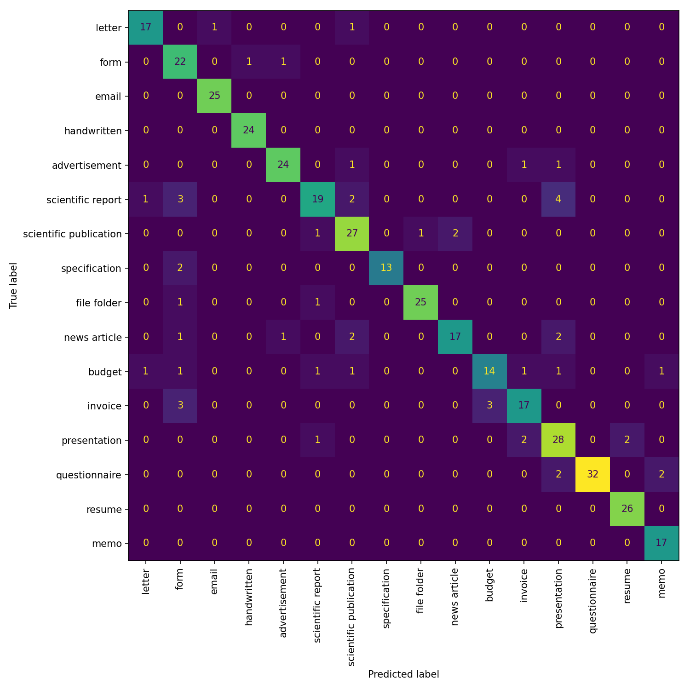
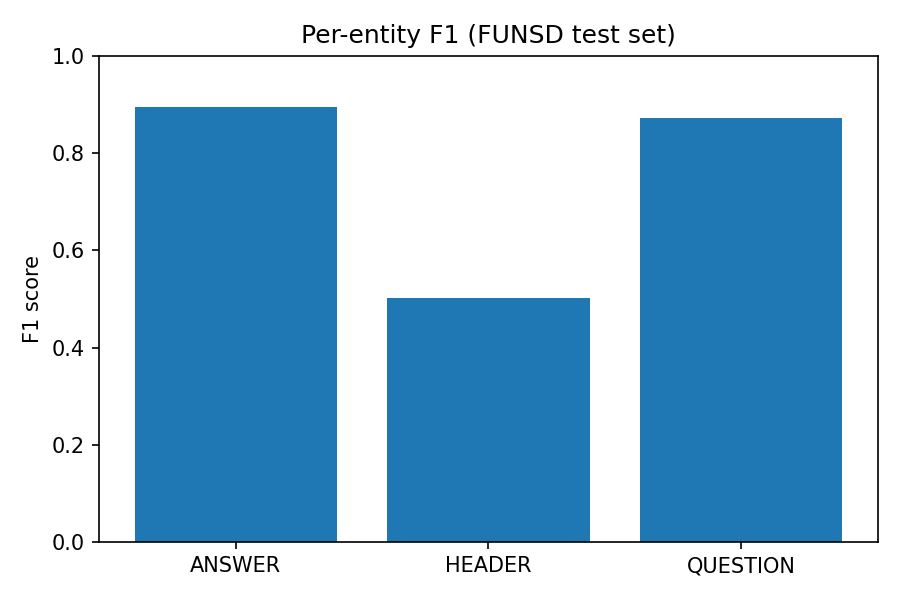
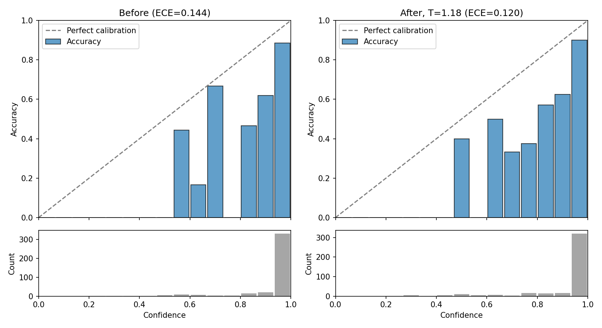
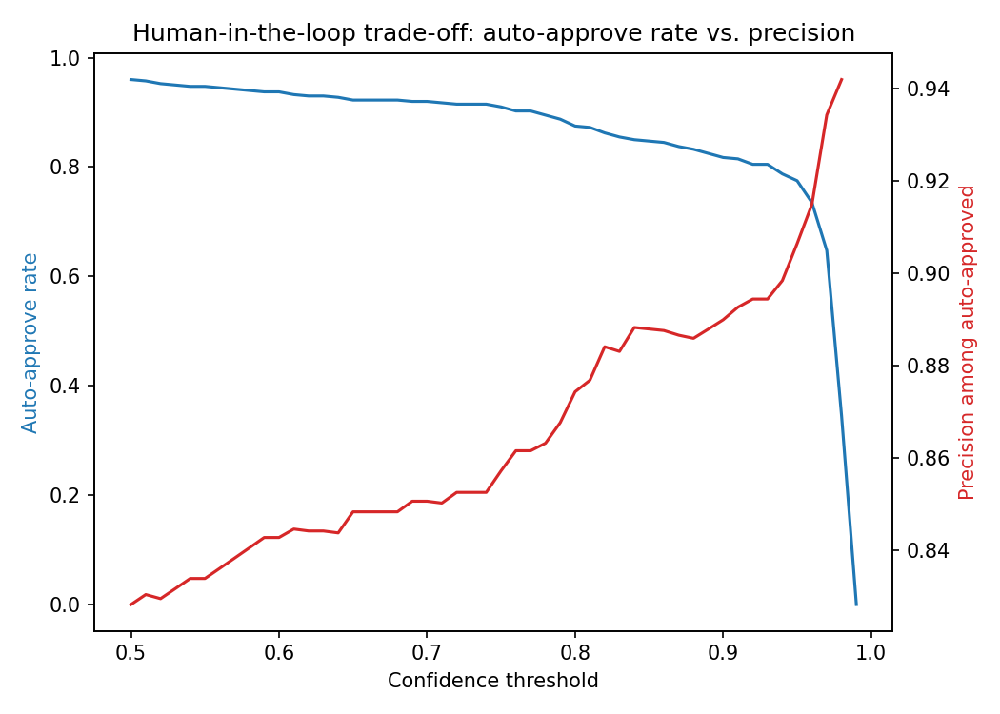

# TrustDoc — A Document AI Trust Layer

Classifies documents, extracts key fields, and — the actual point of the project — calibrates *both* the classifier's and the extractor's confidence, independently, so low-confidence predictions get routed to a human reviewer instead of shipped as fact. This is the same trust-layer pattern used in production document-processing platforms (e.g. Instabase): don't just predict, know when not to trust the prediction.

## Results

**Classifier — LayoutLMv3-base fine-tuned on `rvl_cdip_mini`, 86.75% validation accuracy (80.0% on the held-out test split — see caveat below):**



The 86.75% figure is validation accuracy, used for checkpoint selection during training (the table and confusion matrix below are computed on that same split). The held-out test split — never used for model selection — scores lower, at 80.0% (`results/calibration_summary.json`'s `test_accuracy`). Both numbers are real and both are reported; the gap is normal (validation accuracy is usually a slightly optimistic estimate of generalization since the best checkpoint is chosen against it) but shouldn't be hidden behind a single headline number.

| Class | Precision | Recall | F1 | Support |
|---|---|---|---|---|
| letter | 0.895 | 0.895 | 0.895 | 19 |
| form | 0.667 | 0.917 | 0.772 | 24 |
| email | 0.962 | 1.000 | 0.980 | 25 |
| handwritten | 0.960 | 1.000 | 0.980 | 24 |
| advertisement | 0.923 | 0.889 | 0.906 | 27 |
| scientific report | 0.826 | 0.655 | 0.731 | 29 |
| scientific publication | 0.794 | 0.871 | 0.831 | 31 |
| specification | 1.000 | 0.867 | 0.929 | 15 |
| file folder | 0.962 | 0.926 | 0.943 | 27 |
| news article | 0.895 | 0.739 | 0.810 | 23 |
| budget | 0.824 | 0.667 | 0.737 | 21 |
| invoice | 0.810 | 0.739 | 0.773 | 23 |
| presentation | 0.737 | 0.848 | 0.789 | 33 |
| questionnaire | 1.000 | 0.889 | 0.941 | 36 |
| resume | 0.929 | 1.000 | 0.963 | 26 |
| memo | 0.850 | 1.000 | 0.919 | 17 |

Errors cluster in visually/structurally similar document types rather than randomly — `scientific report`→`presentation` (4x), and `form` is the most common false-positive landing spot (`scientific report`→`form` and `invoice`→`form`, 3x each). `scientific report` (F1 0.731) and `budget` (F1 0.737) are the weakest classes — the same two classes driving those confusions.

**Extractor — LayoutLMv3 token classification fine-tuned on FUNSD, 0.862 micro-avg F1:**



| Entity | Precision | Recall | F1 | Support |
|---|---|---|---|---|
| ANSWER | 0.869 | 0.922 | 0.895 | 805 |
| QUESTION | 0.838 | 0.911 | 0.873 | 1049 |
| HEADER | 0.562 | 0.454 | 0.502 | 119 |

HEADER is the clear weak point, but it also has 7-9x less training signal than the other two entity types — the gap tracks class imbalance, not a bug.

**Calibration — the centerpiece, computed separately for each head (no shared temperature between them).**

*Classifier:* temperature scaling fit on a held-out validation split (T=1.177), evaluated on a separate held-out test split (no fit/eval leakage):



ECE improved from 0.144 to 0.120 after calibration, and MCE (the single-worst-bin metric) improved too, 0.770→0.571. The count panels underneath each chart matter for reading it honestly: roughly 325 of the 400 test examples land in the single 0.9–1.0 confidence bin, so that top-right bar carries far more weight than the sparser mid-confidence bins next to it — exactly the context a bare reliability diagram (accuracy bars with no counts) would hide. This is refit whenever the classifier itself is retrained, since a stale temperature miscalibrates a different model's logits silently (see `configs/calibration.yaml`; `src/pipeline.py` checks the model's revision against the config's pinned value and raises rather than applying a stale temperature).

*Extractor:* temperature scaling fit locally (CPU, no Kaggle needed) against FUNSD's 50-document held-out test split, 8,356 word-level predictions (`scripts/calibrate_extractor.py`, `results/extractor_calibration_summary.json`). Word-level tag accuracy 84.3%; ECE improved from 0.049 to 0.039, MCE from 0.169 to 0.078 after fitting T=1.081. Each extracted field now carries its own calibrated confidence, independent of the document-level classification confidence — previously the extractor had no confidence signal at all.

**Business framing — the actual trust-layer output, per head:**



| | Confidence threshold | Auto-approve rate | Precision among auto-approved |
|---|---|---|---|
| Classifier (per document) | ≥ 0.70 | 92.0% | 85.1% |
| Classifier (per document) | ≥ 0.90 | 81.8% | 89.0% |
| Extractor (per field) | ≥ 0.90 | 62.6% | 90.4% |

Raising the confidence bar trades auto-approval volume for precision — the concrete lever a human-in-the-loop review process would tune, independently for whole-document classification and for individual extracted fields.

## Architecture

```
OCR (Tesseract) -> Classify (LayoutLMv3) -> Calibrate & flag (temperature scaling) -> Extract (LayoutLMv3 NER)
```

`src/pipeline.py` runs this end-to-end against the published models on the Hugging Face Hub:
- [vxa8502/trustdoc-classifier](https://huggingface.co/vxa8502/trustdoc-classifier)
- [vxa8502/trustdoc-extractor](https://huggingface.co/vxa8502/trustdoc-extractor)

## Approach

1. **OCR** — Tesseract (CPU) extracts words + bounding boxes, normalized to LayoutLMv3's required 0-1000 coordinate scale (`src/ocr/tesseract.py`).
2. **Classify** — LayoutLMv3-base fine-tuned on `dvgodoy/rvl_cdip_mini` (a 1% subset of RVL-CDIP; training on the full 320k-image set was too slow on a free-tier T4, and 86.75% accuracy on the mini subset already cleared the project's own 70%-accuracy go/no-go threshold).
3. **Calibrate & flag (classification)** — temperature scaling on the classifier's logits (`src/calibrate/`), with ECE/MCE and reliability diagrams computed before/after on held-out data. Predictions below a tuned confidence threshold are flagged for human review instead of auto-approved.
4. **Extract** — a LayoutLMv3 NER head fine-tuned on FUNSD pulls out HEADER/QUESTION/ANSWER fields, layout-aware (not a big LLM — keeps the pipeline reproducible and GPU-optional at inference time).
5. **Calibrate & flag (extraction)** — the same temperature-scaling/thresholding mechanism as step 3, fit independently against the extractor's own logits (`scripts/calibrate_extractor.py`), so each extracted field carries its own calibrated confidence and its own auto-approve/flag decision — not just the whole document's.

## Limitations & Ethics

**RVL-CDIP (the classifier's training data) has documented issues that affect any model trained on it:**
- Shortcut-feature bias: some predictions may rely on spurious per-page ID codes rather than content.
- ~8% label noise, and a meaningful fraction of train/test duplication.
- Contains real PII; documents are tobacco-industry, 1950s-2002 only, so out-of-domain generalization to modern documents is unproven.

Any accuracy numbers reported here should be read against these caveats, not as a clean benchmark.

**The extractor is form-specific, not general-purpose.** It's fine-tuned on FUNSD (forms with question/answer structure) — running it on a document type with no form-like structure (e.g. an advertisement) correctly returns no extracted fields, since there's nothing FUNSD-shaped to find. That's expected behavior, not a bug, but it means the extractor shouldn't be read as "extracts fields from any document."

**Reliability diagrams can mislead without sample-count context.** A sparsely populated confidence bin can show a bar at 0% or 100% accuracy that's really just noise from a handful of examples — see the count panels under each reliability diagram above, added after exactly this pattern showed up in the real results.

## License

Code is MIT (see `LICENSE`). Both published models are fine-tuned from `microsoft/layoutlmv3-base`, which is **CC BY-NC-SA 4.0 (non-commercial, share-alike)** — the model cards on the Hub declare this explicitly, and it's inherited by both fine-tunes. For commercial use, swap in an MIT-licensed backbone (LiLT or Donut) instead.

## Setup

```bash
pip install -r requirements.txt
```

For local development (running tests, linting, or `scripts/calibrate_extractor.py`), install `requirements-dev.txt` instead — it includes `requirements.txt` plus test/tooling-only extras that the Docker inference image deliberately doesn't ship:

```bash
pip install -r requirements-dev.txt
```

Tesseract must also be installed as a system binary (`apt install tesseract-ocr` / `brew install tesseract`) — already handled in `docker/Dockerfile` and `.github/workflows/ci.yml`.

## Running the pipeline

```bash
python -m src.pipeline path/to/document.png
```

or via Docker:

```bash
docker build -f docker/Dockerfile -t trustdoc .
docker run --rm -v "$(pwd)/path/to:/data:ro" trustdoc /data/document.png
```

Both print a JSON result: `document_type`, calibrated `confidence`, `flagged_for_review` (true below the tuned classification threshold in `configs/calibration.yaml`), and `extracted_fields` — each field carrying its own calibrated `confidence` and its own `flagged_for_review`, independent of the document-level decision.

## Tests

```bash
pytest tests/ -v
ruff check src tests scripts
```

Unit tests cover the OCR wrapper, the calibration math (including a hard regression test that temperature scaling provably preserves prediction accuracy while reducing ECE), and the pipeline's own calibration/flagging logic (model inference itself is mocked in these tests — verified manually against the real published models instead, since re-testing HF Hub network calls in CI would be slow and flaky for no extra correctness signal).

## Repo layout

```
requirements.txt      runtime deps only -- exactly what docker/Dockerfile installs
requirements-dev.txt   + test/lint/local-tooling extras (pytest, matplotlib, datasets)
configs/       training/eval/calibration YAML configs (per-head: classifier + extraction)
data/          dataset provenance notes (no raw data or loader scripts -- each notebook loads its own dataset directly)
notebooks/     Kaggle training/calibration notebooks (00-03, run in order)
scripts/       calibrate_extractor.py -- fits the extraction head's temperature locally (CPU-only, no Kaggle needed)
src/ocr/       Tesseract wrapper
src/classify/  LayoutLMv3 classifier inference
src/extract/   LayoutLMv3 NER extractor inference
src/calibrate/ temperature scaling, ECE/MCE, reliability diagrams, threshold flagging, model-revision checks
src/pipeline.py  end-to-end OCR -> classify -> calibrate/flag -> extract -> calibrate/flag
tests/         pytest suite
docker/        Dockerfile
results/       metrics, figures, reliability diagrams
```
